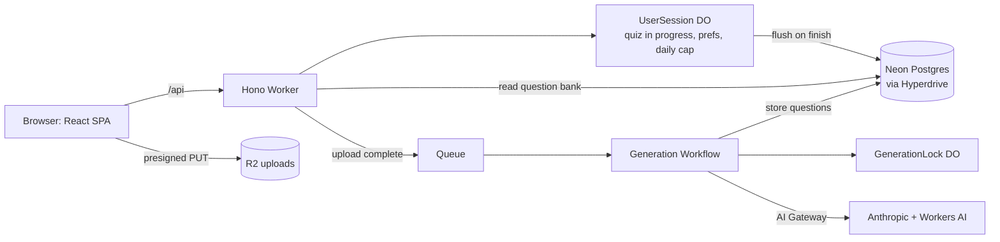

# CreateMyQ

CreateMyQ is an invite-only quiz app for a small group of friends and family. You pick a built-in category, or upload a PDF, and get a quiz. Then you see what you got wrong and why, and can take a review quiz made of the questions you missed.

There is one subject area, software engineering. Sources about anything else are refused.

Making quizzes from your own PDFs is built but currently switched off in production (`GENERATION_ENABLED` is `"false"` in `wrangler.jsonc`). Built-in categories always work.

[CLAUDE.md](CLAUDE.md) is the detailed reference for how everything works and the rules the code follows. This README is the short version. Tickets and their status are in [TASKS.md](TASKS.md).

## How it works

**Making questions and taking a quiz are separate things that happen at different times.** Generation is slow, costs money and sometimes fails, so it runs in the background and writes to a shared question bank in Postgres. Taking a quiz only reads from that bank. It is instant and never calls a model.



- **One origin, one deploy.** A single Cloudflare Worker serves the built SPA (Workers Assets) and the API (Hono, every route under `/api`). No CORS, no second host.
- **Postgres** (Neon, reached through Hyperdrive, Drizzle ORM) holds everything shared: the question bank, finished sessions and answers, misses, sources and their classification decisions, model spend.
- **Durable Objects** hold what belongs to one user and changes constantly. `UserSession` (one per user) keeps the quiz in progress, preferences and the daily generation counter. When a quiz finishes it writes the whole session to Postgres in one transaction with an idempotency key, and retries with an alarm until Postgres confirms. Nothing is deleted from the DO before that. `GenerationLock` (one per content fingerprint) decides which run may fill a question bank.
- **Uploads** go straight from the browser to R2 with a short-lived presigned URL, never through the API.
- **Generation** is a Queue that starts one Workflow run per upload. Each step is durable and safe to run twice: extract text, fingerprint it (an identical upload reuses the existing bank; the unique `content_hash` is the cache), claim the lock, chunk, check the topic (the gate), generate questions, grade them and drop near-duplicates, tag difficulty and format, record spend, store. Fewer than 5 good questions and the run fails visibly.
- **The topic gate** samples the start, middle and end of a source. Workers AI embeddings decide first; when they are unsure, one Claude Haiku call decides. Off-topic sources are refused with a message naming what they look like.
- **Models** are called through Cloudflare AI Gateway: Claude Sonnet generates, Claude Haiku grades and tags, Workers AI embeds.
- **Limits on spend**: a manual kill switch (`GENERATION_ENABLED`), a per-user daily cap (`DAILY_GENERATION_CAP`, in the user's own day) and a global monthly spend ceiling (`SPEND_CEILING_USD`, checked with a reservation before any model call).
- **Sign-in** is Clerk with an email code. The Worker verifies the session token itself, and the `invites` table is the allowlist.

## Tech stack

| Piece | Used for |
|---|---|
| Vite, React 19, TypeScript | the SPA in `src/` |
| Tailwind v4 | styling; every token lives in `src/index.css` |
| Motion for React | transitions (transform and opacity only, off under reduced motion) |
| Hono on Cloudflare Workers | the API in `worker/` |
| Workers Assets | serves the SPA from the same Worker |
| Neon Postgres, Hyperdrive, Drizzle ORM | database, connection pooling, schema and migrations |
| Durable Objects | per-user session, per-fingerprint generation lock |
| R2 | PDF uploads |
| Queues, Workflows | background generation |
| Workers AI, Anthropic via AI Gateway | embeddings, topic gate, generation, grading, tagging |
| Clerk | email code sign-in |
| Sentry, Workers Logs | errors and logs |
| Vitest, PGlite | tests, including SQL tests in an in-process Postgres |

## Running locally

### Prerequisites

- Node 24 (what CI uses; there is no `engines` field) and npm.
- Access to the Cloudflare account. Local dev uses real remote resources: the dev R2 bucket and Workers AI.
- A Neon project, and the `neon` CLI if you want to make throwaway branches.
- A Clerk development instance (Restricted mode, email code, the custom `email` session claim described in [CLAUDE.md](CLAUDE.md#security)).
- An Anthropic API key, only if you want to run generation.

### Install

```bash
git clone <this repo>
cd createmyq
npm ci
```

### Environment files

There are three local files, all gitignored. Copy the examples and fill them in. Never commit them.

**`.env`** (from `.env.example`), read by wrangler and the Vite plugin:

| Variable | What it is |
|---|---|
| `CLOUDFLARE_HYPERDRIVE_LOCAL_CONNECTION_STRING_HYPERDRIVE` | The Postgres connection string local dev uses in place of the Hyperdrive binding. Point it at a dev Neon branch (see the warning below). It is read from `.env` or the shell, not from `.dev.vars`. |

**`.env.local`**, read by Vite and the operator scripts (`neon link` can write the database URLs):

| Variable | What it is |
|---|---|
| `VITE_CLERK_PUBLISHABLE_KEY` | Clerk publishable key of the dev instance, baked into the SPA at build time. |
| `VITE_SENTRY_DSN` | Optional. DSN of the Sentry web project. Unset means Sentry is not in the bundle. |
| `DATABASE_URL_UNPOOLED` | Direct (unpooled) Neon URL used by `db:migrate`, `db:seed` and `report`. |
| `SEED_DATABASE_URL` | Optional. Overrides the target of `db:seed`. |
| `REPORT_DATABASE_URL` | Optional. Overrides the target of `report`. |

**`.dev.vars`** (from `.dev.vars.example`), the Worker's local secrets and var overrides. Keep this file even if it is empty: without it wrangler falls back to `.env` and exposes every variable there to the Worker.

| Variable | What it is |
|---|---|
| `CLERK_JWT_KEY` | Clerk JWKS public key (PEM, in double quotes with its line breaks). The Worker verifies session tokens with it, without a network call. Missing means every protected route fails closed. |
| `R2_ACCESS_KEY_ID`, `R2_SECRET_ACCESS_KEY` | R2 API token (Object Read & Write) used to presign upload URLs. |
| `UPLOADS_BUCKET_NAME` | Set to the dev bucket, so local dev never signs for the production bucket. |
| `ANTHROPIC_API_KEY` | Only needed for generation. |
| `GENERATION_ENABLED` | Set to `true` to generate locally (it is `"false"` in `wrangler.jsonc`). |
| `DAILY_GENERATION_CAP`, `SPEND_CEILING_USD` | Optional overrides, to test the limits. |
| `SENTRY_DSN`, `SENTRY_ENVIRONMENT` | Optional. Worker Sentry; set the environment to `development` locally. |

Non-secret vars (`R2_ACCOUNT_ID`, `AI_GATEWAY_URL`, the limits) are in `wrangler.jsonc`.

> [!WARNING]
> **Local dev can write to the production database.** The Worker talks to whatever `CLOUDFLARE_HYPERDRIVE_LOCAL_CONNECTION_STRING_HYPERDRIVE` points at, and the operator scripts write to whatever `DATABASE_URL_UNPOOLED` points at. If either is a production connection string, quizzes you take locally, uploads and seeds land in production. Point both at a dev branch:
>
> ```bash
> neon branches create --name dev-<you>
> neon connection-string dev-<you>   # drop the channel_binding parameter for the Hyperdrive string
> ```
>
> `db:seed` and `report` print the Neon endpoint they are about to use. Check it before you go on.

### Database

Migrations are generated SQL in `drizzle/` and always run against the direct (unpooled) URL, never Hyperdrive. Test a migration on a throwaway branch first:

```bash
DATABASE_URL_UNPOOLED="$(neon connection-string <branch>)" npm run db:migrate
```

pgvector is enabled by the first migration. Schema changes are made only by tickets that say so (`npm run db:generate` after editing `worker/db/schema.ts`; never edit an applied migration).

Load the built-in questions with `npm run db:seed -- seed/system-design.json` (add `--dry-run` to validate and roll back). Seeding upserts by `external_id` in one transaction, never changes the status of an existing question, and never touches questions missing from the file.

### Start the app

```bash
npm run dev
```

This runs Vite with the Cloudflare plugin: the SPA and the Worker together, the Worker in local workerd, on port 5173 by default. Durable Objects, Queues and Workflows run locally (state in `.wrangler/state`). Two bindings are remote even in dev, and are billed: R2 (`remote: true`, using the `createmyq-uploads-dev` bucket through `preview_bucket_name`) and Workers AI. Model calls go to Anthropic through AI Gateway.

To sign in locally you need an `invites` row for your email in the database you point at, and a user in the Clerk dev instance (see [Access](#access)).

## Commands

| Command | What it does |
|---|---|
| `npm run dev` | SPA and Worker together, Worker in local workerd |
| `npm run typecheck` | `tsc -b` across the app, worker and node projects |
| `npm run lint` | eslint |
| `npm test` | vitest: pure logic, the UserSession DO over fake storage, SQL in PGlite. No network |
| `npm run build` | typecheck, then the Vite build into `dist/` |
| `npm run preview` | build, then `vite preview` |
| `npm run deploy` | build, then `wrangler deploy` (CI does this on merge) |
| `npm run cf-typegen` | regenerate `worker-configuration.d.ts`; run after every `wrangler.jsonc` change |
| `npm run db:generate` | diff `worker/db/schema.ts` into a new SQL migration |
| `npm run db:migrate` | apply pending migrations to `DATABASE_URL_UNPOOLED` |
| `npm run db:check` | sanity-check the migration history |
| `npm run db:seed -- seed/<file>.json [--dry-run]` | validate a question file and upsert it |
| `npm run extract -- <file.pdf or url> [--out t.txt] [--chunks]` | run extraction (and chunking) in Node and print the result; writes nothing |
| `npm run eval:check` | load the topic gate eval set and print its breakdown |
| `npm run eval:snapshot -- <id> [--pdf file]` | rewrite a committed eval text from its real source |
| `npm run eval:bench` | benchmark the gate's classifiers on the eval set (billed) |
| `npm run eval:tags [-- --runs 3]` | rate the seed questions' difficulty with the real tagger and compare with human labels (billed) |
| `npm run report` | the read-only cost and usage report (see [Cost report](#cost-report)) |

Always use `npx wrangler`, never a global `wrangler`.

## Testing

- `npm test` runs every `*.test.ts` (they sit next to the code). Rules are pure functions with unit tests. The `UserSession` DO is tested over a fake storage. The flush, misses, review and report SQL run against the real migrations in PGlite, an in-process WASM Postgres, so no database or network is needed.
- The topic gate has an eval set of 50 sources (25 software engineering, 25 not) in `fixtures/eval/`. Its labelling rules and licence policy are in [fixtures/eval/README.md](fixtures/eval/README.md), and the benchmark result is in `fixtures/eval/results/`.
- `npm run eval:bench` needs the classifier harness running in another terminal, because Workers AI is only reachable from workerd:

  ```bash
  npx wrangler dev -c scripts/classifier-harness/wrangler.jsonc --port 8798
  npm run eval:bench -- --classifier fallback
  ```

  Every call is billed (about $0.005 per source for Haiku, much less for embeddings). Runs are saved in `fixtures/eval/.runs/` (gitignored).
- `npm run eval:tags` calls Haiku for real (about $0.016 a run) and reads `ANTHROPIC_API_KEY` from the shell or `.dev.vars`.
- End-to-end checks are done by hand on a local dev server pointed at a throwaway Neon branch. `scripts/pg-fault-proxy.ts` can inject flush failures for that (see its file header).

## Deploying

`.github/workflows/ci.yml` runs typecheck, lint, test and build on every pull request and push to `main`. A push to `main` (a merge) then runs `npm run deploy` with the wrangler version from `package-lock.json`. Deploys never overlap. Merging is deploying.

**GitHub repository secrets:** `CLOUDFLARE_API_TOKEN` and `CLOUDFLARE_ACCOUNT_ID`. The token starts from the "Edit Cloudflare Workers" template and also needs Queues and Workflows edit permissions.

**GitHub repository variables** (public values, baked into the SPA): `VITE_CLERK_PUBLISHABLE_KEY`, and optionally `VITE_SENTRY_DSN`.

**Worker secrets**, set once with `npx wrangler secret put <NAME>`, never in the repo or the CI config: `CLERK_JWT_KEY`, `R2_ACCESS_KEY_ID`, `R2_SECRET_ACCESS_KEY`, `ANTHROPIC_API_KEY`, and optionally `SENTRY_DSN` and `SENTRY_ENVIRONMENT`.

**Cloudflare resources that must exist before a deploy:**

- Hyperdrive config pointing at the production Neon branch (its id is in `wrangler.jsonc`).
- Queues `createmyq-generation` and `createmyq-generation-dlq` (`npx wrangler queues create <name>`).
- R2 buckets `createmyq-uploads` and `createmyq-uploads-dev`. Each bucket's CORS must allow `PUT` with the `Content-Type` header from the app's origin (`http://localhost:5173` for the dev bucket, your workers.dev origin for production).
- An AI Gateway named `createmyq`.

Durable Objects and the Workflow are created by the deploy itself.

## Monitoring and observability

Logs, Sentry and the cost report never contain question text, source text, answers or email addresses. They use ids only.

### Workers Logs

`observability.enabled` in `wrangler.jsonc` keeps every invocation's `console.*` output. Each line is JSON with an `event` field. Find them in the Cloudflare dashboard (Workers & Pages, the `createmyq` Worker, Logs) and filter on `event`, or stream them with `npx wrangler tail --format json`.

| To see | Filter on |
|---|---|
| One upload's run | `sourceId` = the id (or `instanceId` = `source-<id>`): `generation_step_ok` / `generation_step_failed` (with `step` and `attempt`), then `generation_gate_decision`, `generation_filter_summary`, `generation_tag_summary`, `generation_run_summary` (tokens, `costUsd`), `spend_reserved`, `spend_recorded` |
| Generation failures | `generation_run_failed`, `generation_failed_without_lock`, `generation_filter_degraded` (grading or embedding degraded; the run continues), `daily_cap_refund_failed` |
| Limits | `daily_cap_counted`, `spend_ceiling_reached` |
| Who holds a bank | `generation_lock_*` (claimed, busy, renewed, lost, released) |
| Quiz results not yet in Postgres | `session_flush_failed`, `session_flush_retry_scheduled`, and `session_flush_STUCK` |

`session_flush_ok` means a finished quiz reached Postgres. `session_flush_STUCK` is logged as an error after 10 failed flush passes in a row. It means a friend's results exist only in their Durable Object: stop and fix it. The alarm keeps retrying (backing off up to every 10 minutes), and neither Postgres nor the report can see that quiz until it lands.

To inspect one generation run: `npx wrangler workflows instances describe createmyq-generation source-<sourceId>`, or the dashboard's Workflows page.

### Sentry

Errors only, no tracing.

- **Worker** (`@sentry/cloudflare`): wraps the `fetch` and `queue` handlers and the `GenerationWorkflow` (a step that fails its last retry). Errors handled by `app.onError` and the Workflow's unexpected-failure branch are captured explicitly.
- **Durable Objects are not wrapped.** Sentry's DO wrapper writes its own keys into DO storage on every alarm, and `UserSession` storage is the quiz flush path. DO errors that reach a route are captured by `app.onError`; the flush alarm's errors are in Workers Logs.
- **SPA** (`@sentry/react`): loaded with a dynamic import only when `VITE_SENTRY_DSN` was set at build time.
- **Scrubbing** (`worker/observability/sentry.ts`, `src/lib/sentry-scrub.ts`, unit-tested): no breadcrumbs, user, extra data, headers, cookies or bodies; requests keep only the method and the URL without its query string. Emails, bearer tokens, JWTs, query strings and Postgres URLs in messages are masked.
- **Off unless configured.** No `SENTRY_DSN` secret means nothing is sent; no `VITE_SENTRY_DSN` at build means the SDK is not in the bundle.

One-time setup: create a Sentry organisation with two projects, a Cloudflare one for the Worker and a React one for the SPA. Put the Worker project's DSN in the `SENTRY_DSN` Worker secret (`npx wrangler secret put SENTRY_DSN`) and the web project's DSN in the `VITE_SENTRY_DSN` GitHub variable (`gh variable set VITE_SENTRY_DSN`). Add an alert rule "a new issue is created" that emails you. Source maps are not uploaded, so SPA stacks are minified.

### AI Gateway

Every Anthropic call goes through the `createmyq` AI Gateway, which logs each request with its tokens and its own cost estimate (Cloudflare dashboard, AI, AI Gateway). Workers AI usage is under AI, Workers AI. Use these to cross-check the cost report, which reads our own records.

### Cost report

`npm run report` answers "what did this week cost?" with one read-only command.

```bash
npm run report                        # last 7 days, rolling
npm run report -- --week              # this week, Monday 00:00 to now
npm run report -- --last-week
npm run report -- --days 30
npm run report -- --since 2026-10-01 --until 2026-10-07
```

Options: `--tz <IANA zone>` for the window boundaries (default UTC), `--json`, `--top N` (most expensive runs, default 5), `--ceiling USD` (default: `SPEND_CEILING_USD` from `wrangler.jsonc`).

It connects to `REPORT_DATABASE_URL` if set, else `DATABASE_URL_UNPOOLED` (shell, then `.env.local`), prints the Neon endpoint it targets, and runs every query in one read-only transaction that it rolls back. It never writes.

Sections:

- **Quizzes taken**: finished quizzes in the window, by kind, and how many people took them.
- **Uploads and cache**: uploads by status, and the cache hit rate. A cache hit is an upload whose fingerprint matched an existing bank and that called no model itself. The rate is hits divided by uploads that reached the fingerprint step.
- **Spend**: recorded spend (real model calls, by purpose, model and run outcome), plus *held* spend: $0.20 reservations not yet released (a run in progress, a cost that was unknown, or a run that failed after reserving). Held spend counts against the ceiling, so it is always shown and never mixed into recorded spend. Also cost per ready bank and the top runs.
- **Month to date**: recorded plus held spend in the current UTC calendar month against the ceiling, and what is left.
- **Health**: failed or refused sources by error code, sources stuck in `uploaded` or `processing` for more than 30 minutes, and late flushes (session rows written more than 60 seconds after the quiz finished, so the alarm retry landed them). Unflushed quizzes are only visible in Workers Logs.

### Operating generation in production

Three gates, checked in this order before any model call:

1. **`GENERATION_ENABLED`** (var in `wrangler.jsonc`): the manual kill switch. Anything but `"true"` fails new runs with "Making quizzes from your own files is switched off for now." It is `"false"` today; turning it on is a small PR.
2. **`DAILY_GENERATION_CAP`** (var, default 3): runs per user per day, reset at the user's local midnight. Runs that end before reaching a model are refunded.
3. **`SPEND_CEILING_USD`** (var, default 15): dollars per UTC calendar month across everyone. Each run reserves $0.20 under an advisory lock before any model call; if that would cross the ceiling, the run stops and uploads are refused with a message saying why.

**To stop spend instantly**, set `GENERATION_ENABLED` to `"false"` or `SPEND_CEILING_USD` to `"0"` in `wrangler.jsonc` and merge (merging deploys). Changing a var in the Cloudflare dashboard also works but is overwritten by the next deploy. A run that already reserved finishes. Taking quizzes is never affected.

## Access

CreateMyQ is invite-only, with two layers. Clerk runs in Restricted mode, so strangers cannot create accounts, and the `invites` table is the allowlist and source of truth: a signed-in email that is not in `invites` gets 403 `not_invited`. Adding a person means adding an `invites` row and creating their user in Clerk. Removing a person means removing both. The `users` row is created on their first request.

Every `/api` route requires a valid session except `GET /api/health`. New routes are protected by default.

## Project structure

```
src/                     React SPA (never imports from worker/)
  index.css              the theme: every colour, type size, radius and shadow
  lib/                   API client, typed quiz API, results maths, router, hooks
  components/            small UI primitives and the quiz setup fields
  screens/               one file per screen (Auth, Home, Setup, Quiz, Result)
  quiz/                  question screen parts and the quiz runner
worker/
  index.ts               Hono app: middleware and route wiring
  auth/                  Clerk token verification and the invite check
  quiz/                  quiz assembly, session routes, pure quiz rules, flush, misses, review
  durable/               UserSession and GenerationLock Durable Objects
  uploads/               upload rules, presigning, upload routes
  extract/, chunk/       text extraction, fingerprinting, chunking (pure where possible)
  classifier/            the topic gate and the difficulty tagger
  workflows/             the generation Workflow, queue consumer, generate, filter, store
  limits/                daily cap and spend ceiling
  observability/         Sentry options and scrubbing
  db/                    Drizzle schema and client
drizzle/                 generated SQL migrations (never edit an applied one)
seed/                    built-in question files
scripts/                 operator scripts: seed, extract, report, eval, dev-only harnesses and fault proxy
fixtures/eval/           the topic gate eval set
wrangler.jsonc           Worker config and bindings
```

The full annotated layout is in [CLAUDE.md](CLAUDE.md#layout).

## Contributing

- One ticket per branch, one PR, one merge. Branch names are `stm-<n>-<short-slug>`. Tickets are in [TASKS.md](TASKS.md).
- Stay inside the ticket. Bindings, tables and dependencies arrive with the ticket that needs them.
- Routes do HTTP only. Rules are pure functions with unit tests. Durable Object storage stays in the DO.
- UI: right and wrong are never shown by colour alone, tap targets are at least 44px, reduced motion turns transitions off, and the quiz works by keyboard (number keys select, Enter submits).

A ticket is done when its acceptance criteria are checked by running it; `npm run typecheck`, `npm run lint` and `npm test` pass; there are no secrets in the repo; errors surface as a handled message, never a stack trace; and it is merged and deployed. Then tick it in [TASKS.md](TASKS.md).

## Limits and targets

| | |
|---|---|
| PDF upload | at most 50 pages and 20 MB; scanned PDFs are not supported |
| Quiz length | 5, 10 or 20 questions |
| Repeats | questions seen in the last 30 days are skipped until the pool runs out |
| Sign-in session | 7 days (Clerk free plan) |
| Generation | 20 to 25 questions per source; fewer than 5 fails the run |
| Speed | quiz start under 1 s, multiple choice answer under 300 ms, cached source under 2 s, generation about 90 s |
| Cost | under $15 a month, under $0.15 per source |
| Daily cap | 3 generation runs per user per day |
